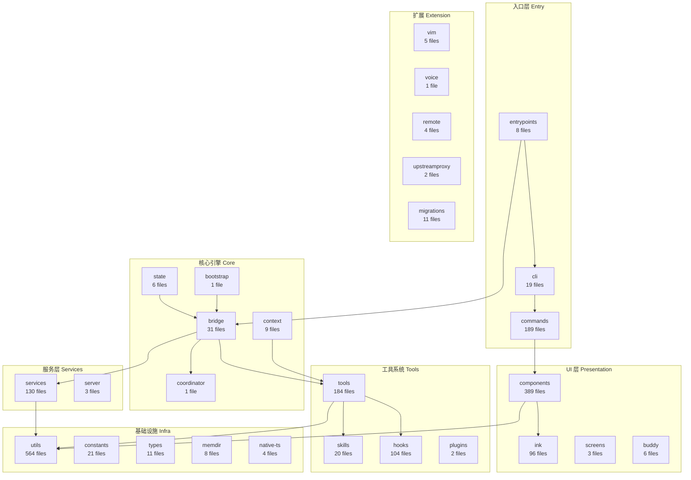
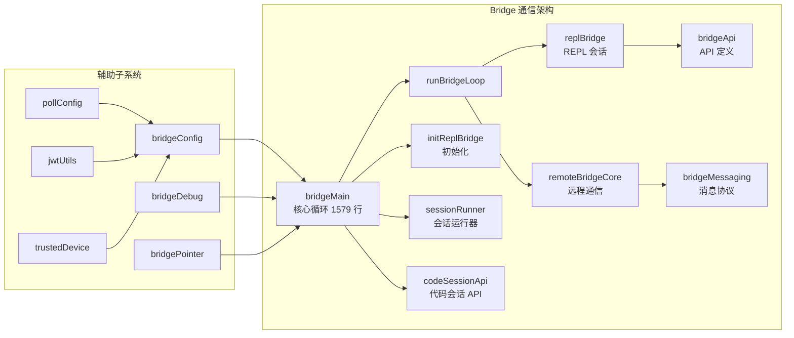
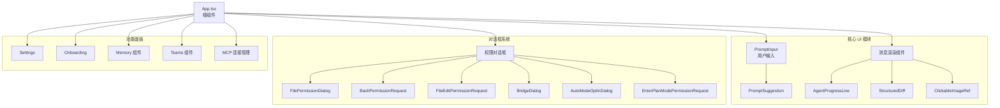
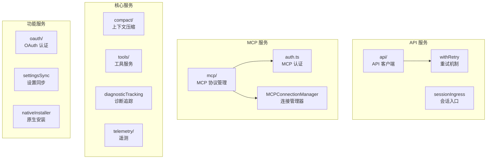
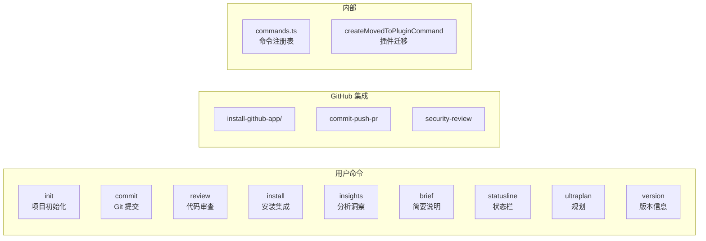
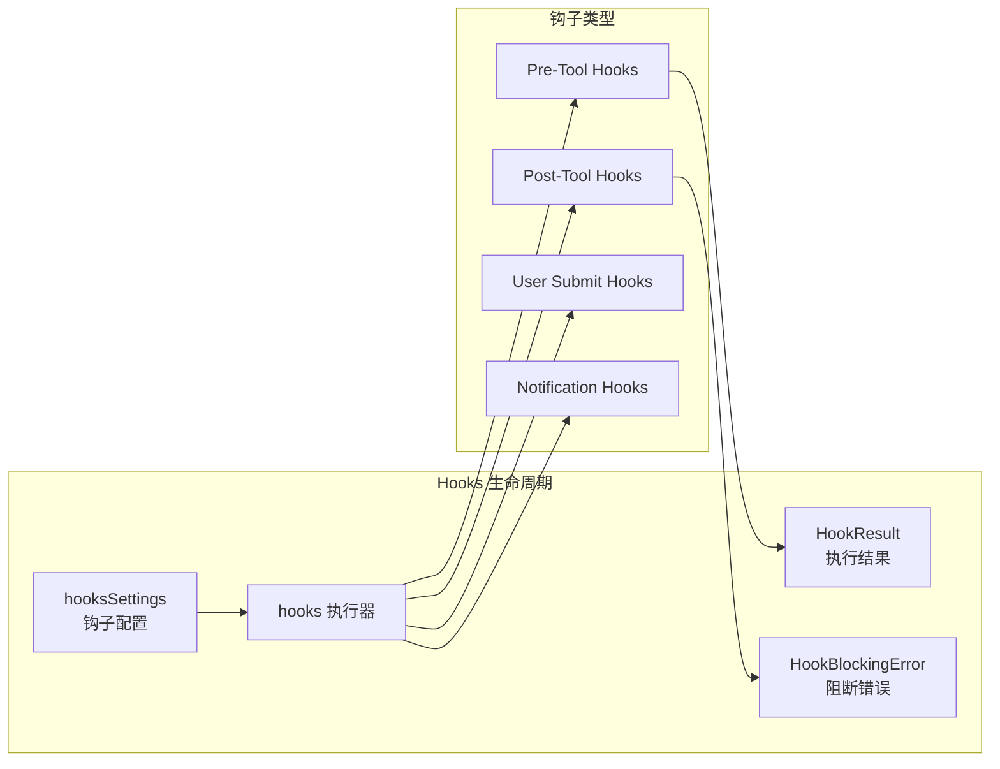
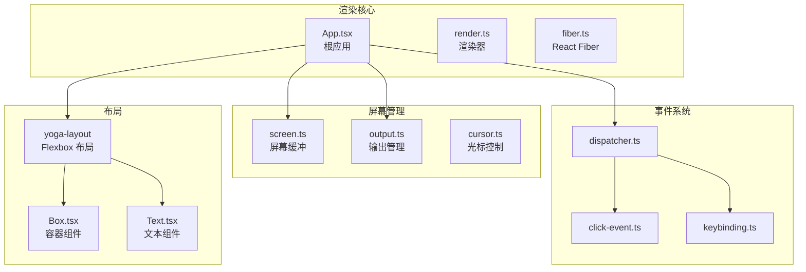
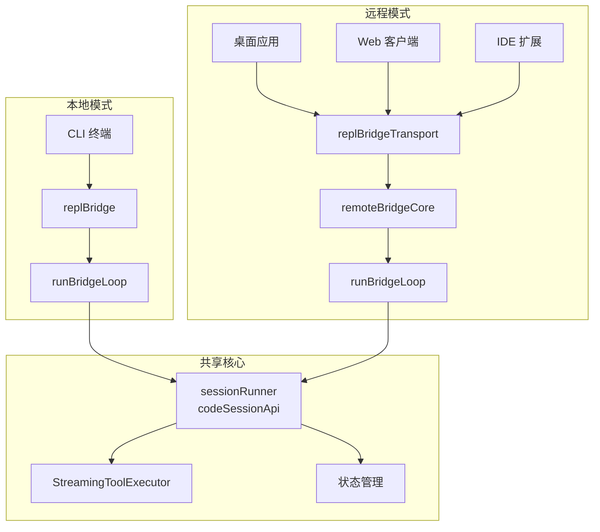
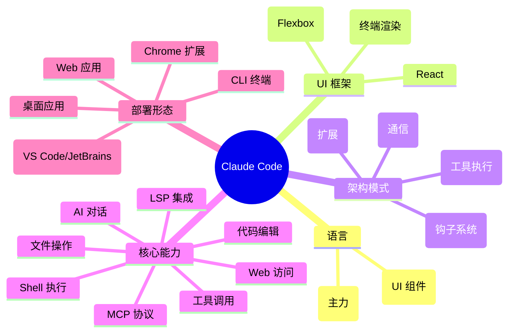

# Claude Code 项目架构分析

> 基于 GitNexus 知识图谱分析生成 | 2026-03-31

## 项目概览

| 指标 | 数值 |
|------|------|
| 源码文件 | 1,884 个 (.ts/.tsx) |
| 函数 | 9,390 个 |
| 方法 | 1,804 个 |
| 类 | 128 个 |
| 接口 | 72 个 |
| 模块目录 | 36 个 |
| GitNexus 社区 | 1,068 个 |
| 执行流 | 300 条 |

## 运行时约定

- 默认运行时是 Bun，不是 npm/node。
- 本地脚本优先用 `bun run <file>` 或 `bunx <tool>`。
- 项目里可直接使用 Bun 原生能力，例如 `bun:bundle`、`Bun.file`、`Bun.spawn`。
- 运行时自检入口见 [`scripts/bun-tools.ts`](/E:/Github/claude-code/scripts/bun-tools.ts)。
- 基本开发与提交规范见 [`CONTRIBUTING.md`](/E:/Github/claude-code/CONTRIBUTING.md)。
- 提交信息默认使用 `type(scope): 中文说明` 形式。

---

## 架构全景图



---

## 核心模块详解

### 1. Bridge（桥接层）— 31 files

项目最核心的通信枢纽，连接客户端（CLI/桌面/Web）与后端 AI 服务。



| 文件 | 职责 |
|------|------|
| `bridgeMain.ts` | 核心桥接循环，1400+ 行，管理整个生命周期 |
| `replBridge.ts` | REPL 模式下的桥接实现 |
| `remoteBridgeCore.ts` | 远程通信核心，处理消息读写 |
| `bridgeApi.ts` | API 接口定义与错误类型 |
| `bridgeMessaging.ts` | 消息协议与序列化 |
| `sessionRunner.ts` | 会话运行管理 |
| `jwtUtils.ts` | JWT 认证工具 |
| `trustedDevice.ts` | 设备信任管理 |

---

### 2. Tools（工具系统）— 184 files

为 AI 提供操作系统能力的工具集，是项目最大的子系统之一。

```mermaid
graph TB
    subgraph "工具注册与执行"
        STE[StreamingToolExecutor<br/>流式工具执行器]
        STE --> QUEUE[processQueue<br/>队列处理]
        STE --> ADD[addTool<br/>工具注册]
        STE --> CAN[canExecuteTool<br/>权限检查]
        STE --> DESC[getToolDescription<br/>工具描述]
    end

    subgraph "内置工具集"
        BASH[BashTool]
        FILE_R[FileReadTool]
        FILE_W[FileWriteTool]
        FILE_E[FileEditTool]
        GLOB[GlobTool]
        GREP[GrepTool]
        WEB_F[WebFetchTool]
        WEB_S[WebSearchTool]
        LSP[LSPTool]
        MCP_T[MCPTool]
        NOTE[NotebookEditTool]
    end

    subgraph "管理工具"
        TASK_C[TaskCreateTool]
        TASK_U[TaskUpdateTool]
        TASK_L[TaskListTool]
        SKILL_T[SkillTool]
        CRON[ScheduleCronTool]
        AGENT[AgentTool]
    end

    STE --> BASH & FILE_R & FILE_W & FILE_E
    STE --> GLOB & GREP & WEB_F & WEB_S
    STE --> LSP & MCP_T & NOTE
    STE --> TASK_C & TASK_U & TASK_L
    STE --> SKILL_T & CRON & AGENT
```



---

### 3. Components（UI 组件）— 389 files

基于 React + Ink 的终端 UI 渲染层。



---

### 4. Services（服务层）— 130 files



---

### 5. Commands（命令系统）— 189 files



---

### 6. Hooks（钩子系统）— 104 files

GitNexus 识别的最大社区（258 symbols），内聚度 0.62。



---

### 7. Ink（终端渲染框架）— 96 files

自定义的终端渲染引擎（基于 Ink/React）。



---

## 数据流与执行流

### 主执行流：用户输入到 AI 响应

```mermaid
sequenceDiagram
    participant User
    participant CLI
    participant Bridge
    participant Loop
    participant Tool
    participant API
    participant Hook

    User->>CLI: 输入命令/消息
    CLI->>Bridge: 初始化桥接
    Bridge->>Loop: 启动主循环
    Loop->>API: 发送请求到 AI
    API-->>Loop: 流式响应
    Loop->>Tool: 解析工具调用
    Tool->>Hook: Pre-tool 钩子
    Hook-->>Tool: 放行/阻断
    Tool->>Loop: 执行工具返回结果
    Loop->>API: 发送工具结果
    API-->>Loop: 最终响应
    Loop->>Bridge: 渲染输出
    Bridge->>User: 显示结果
```

### Bridge 通信模型



---

## 模块规模排名

```mermaid
chart bar
    title 各模块文件数量
    xAxis ["utils","components","commands","tools","services","hooks","ink","bridge","constants","skills","cli","keybindings","tasks","types","migrations","context","memdir","entrypoints","state","buddy"]
    yAxis "文件数"
    series [564,389,189,184,130,104,96,31,21,20,19,14,12,11,11,9,8,8,6,6]
```

---

## 高内聚社区 Top 15

GitNexus 通过社区检测算法识别出的功能聚类：

| 社区 | 符号数 | 内聚度 | 职责 |
|------|--------|--------|------|
| Hooks | 258 | 0.62 | 钩子生命周期管理 |
| NativeInstaller | 133 | 0.41 | 原生应用安装 |
| LocalAgentTask | 102 | 0.49 | 本地子代理任务 |
| Vim | 97 | 0.92 | Vim 模式模拟（高内聚） |
| Mcp | 91 | 0.43 | MCP 协议集成 |
| Plugins | 86 | 0.16 | 插件系统 |
| Bash | 76 | 1.00 | Bash 工具（最高内聚） |
| Resume | 55 | 0.62 | 会话恢复 |
| Swarm | 52 | 0.60 | 多代理协作 |
| Compact | 48 | 0.57 | 上下文压缩 |
| Teleport | 47 | 0.59 | 远程 Teleport 功能 |
| Telemetry | 36 | 0.64 | 遥测数据收集 |
| Coordinator | 34 | 0.54 | 任务协调器 |
| Bridge | 34 | 0.49 | 桥接通信 |
| Components | 31 | 0.85 | UI 组件（高内聚） |

---

## 技术栈总结



---

## 关键路径说明

| 路径 | 起点 | 终点 | 步骤 | 说明 |
|------|------|------|------|------|
| Bridge 主循环 | `bridgeMain:runBridgeLoop` | `debugFilter:extractDebugCategories` | 8 | 桥接循环 → 调试分类 |
| 定时任务 | `UseScheduledTasks` | `WriteOut` | 8 | 定时任务调度 → 输出 |
| 内存选择器 | `MemoryFileSelector` | `TasksV2Store` | 8 | 内存文件选取 → 任务存储 |
| 工具调用 | `Call` | `WriteOut` | 7 | 工具调用 → 输出结果 |
| 配置迁移 | `UseScheduledTasks` | `MigrateConfigFields` | 7 | 任务调度 → 配置迁移 |
